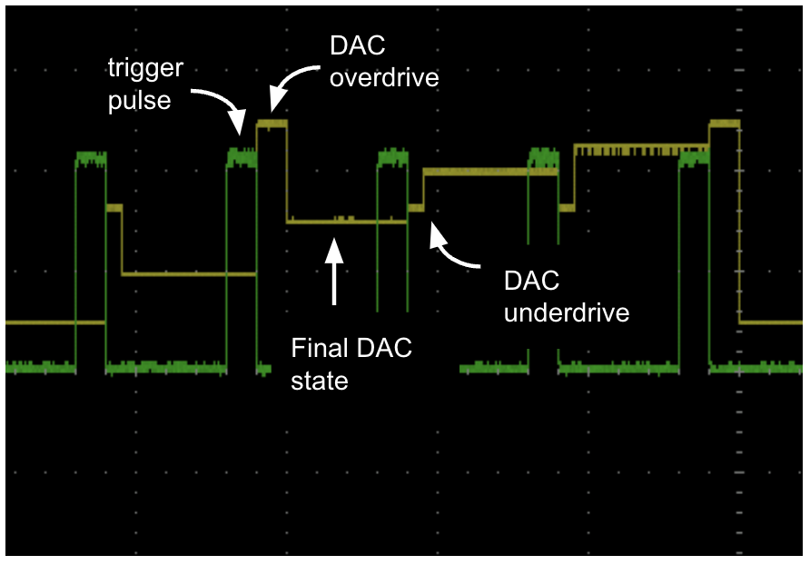

# Overview
This firmware allows voltage overdrive and underdrive pulses to be applied at the beginning of the analog output signal as illustrated in this .

Overdrive pulses can be incorporated into DAC sequences. The voltage and duration of each overdrive pulse can be independently programmed.

Extensions of the original firmware to enable overdrive pulses include:
 - POV: "Program Over Voltage". 
	This command sets the voltage of the overdrive pulse
 - POD: "Program OverVoltage Delay".
	This command sets the duration of the overdrive pulse. After this time expires, the voltage on the specified pin will set to the state specified in the PAS list. 
 - BAD (sets delay in blanking mode of analog output) and BAL (sets length of analog output pulse in blanking mode) commands are deprecated.

 - See command info using "?\n" command for details on use. 

Ensure the correct firmware version is used for a given board serial number, as described earlier.

For more information on serial # or if you have errors please contact ARC at advancedreseach-consulting.com

Special thanks to the Mehta Lab at the Chan Zuckerburg Biohub for supporting these extensions! 